<div align="center">

# 𝓦𝓲𝓼𝓼𝓪𝓵 𝓑𝓐𝓓𝓡𝓘


*"Great software lives at the intersection of logic and creativity"*


</div>

## ✦ About Me

I'm a **Software Engineering student** at ESTEM, Morocco, with a passion for crafting sophisticated digital solutions that marry technical excellence with intuitive design. My approach to development is rooted in precision, elegance, and an unwavering commitment to quality.

I specialize in building robust full-stack applications using modern frameworks and enterprise-grade technologies. My expertise spans the entire development lifecycle—from architecting scalable backend systems with Spring Boot to designing seamless user experiences with React and Angular.

📍 **Based in:** Casablanca, Morocco  
🎓 **Education:** ESTEM - Software Engineering (2022-2027)  
🔬 **Foundation:** Baccalauréat Sciences Physiques (BIOF) - 2022

---

## ✦ Technical Expertise

<div align="center">

<table>
<tr>
<td align="center" width="33%">

### 🎨 Frontend & Mobile


**Modern UI Development**


</td>
<td align="center" width="33%">

### ⚙️ Backend Engineering


**Robust Server Solutions**


</td>
<td align="center" width="33%">

### 💾 Data Systems


**Database Mastery**


</td>
</tr>
</table>

</div>

<div align="center">

### Development Workflow

```mermaid
%%{init: {'theme':'dark', 'themeVariables': { 'primaryColor':'#C9A0DC', 'primaryTextColor':'#fff', 'primaryBorderColor':'#C9A0DC', 'lineColor':'#C9A0DC', 'secondaryColor':'#2d1b3d', 'tertiaryColor':'#1a1a1a'}}}%%
flowchart TD
    A[💡 Ideation] --> B[🎨 Design]
    B --> C[⚡ Development]
    C --> D[🧪 Testing]
    D --> E[🚀 Deployment]
    E --> F[📊 Monitoring]
    F --> |Iterate| A
    
    style A fill:#C9A0DC,stroke:#C9A0DC,stroke-width:2px,color:#000
    style B fill:#2d1b3d,stroke:#C9A0DC,stroke-width:2px
    style C fill:#2d1b3d,stroke:#C9A0DC,stroke-width:2px
    style D fill:#2d1b3d,stroke:#C9A0DC,stroke-width:2px
    style E fill:#2d1b3d,stroke:#C9A0DC,stroke-width:2px
    style F fill:#2d1b3d,stroke:#C9A0DC,stroke-width:2px
```



</div>

---

## ✦ GitHub Activity

<div align="center">


<br/>

<table align="center">
<tr>
<td align="center" width="50%">

### 📊 Language Distribution


</td>
<td align="center" width="50%">

### 🏆 GitHub Statistics


</td>
</tr>
</table>

</div>

---

## ✦ Current Focus

<div align="center">

```
🎯 Mastering enterprise-level development & modern architectural patterns
```

</div>

<table>
<tr>
<td width="50%" valign="top">

### ⚛️ React Ecosystem
```javascript
const expertise = {
  focus: "Advanced State Management",
  mastering: ["Custom Hooks", "Performance Optimization"],
  goal: "Lightning-fast user interfaces"
};
```
> Building next-generation web experiences with cutting-edge React patterns

</td>
<td width="50%" valign="top">

### 🅰️ Angular Framework
```typescript
interface Skills {
  architecture: "Component-based";
  patterns: "Dependency Injection";
  reactive: "RxJS Mastery";
}
```
> Creating scalable enterprise applications with robust architecture

</td>
</tr>
<tr>
<td width="50%" valign="top">

### 🍃 Spring Boot Microservices
```java
@RestController
public class Expertise {
    // RESTful API Design
    // Security Implementation
    // Cloud-Native Development
}
```
> Engineering reliable backend systems for mission-critical applications

</td>
<td width="50%" valign="top">

### 🗄️ Database Systems
```sql
SELECT skills FROM expertise
WHERE technology IN ('Oracle', 'PostgreSQL')
AND proficiency = 'Advanced';
-- SQL Optimization | Stored Procedures | Design Patterns
```
> Architecting high-performance data solutions

</td>
</tr>
</table>

<div align="center">

### 🎨 Design Philosophy

*User-centric development focused on **accessibility**, **responsiveness**, and **aesthetic excellence***

</div>

---

## ✦ Vision for 2025

<div align="center">


</div>

<table>
<tr>
<td width="33%" align="center">

### 🚀 Launch & Scale

**Production Applications**

Develop and deploy full-stack solutions addressing real-world challenges with measurable impact

</td>
<td width="33%" align="center">

### 🤝 Collaborate & Contribute

**Open Source Engagement**

Actively contribute to established projects and engage with the global developer community

</td>
<td width="33%" align="center">

### 📚 Master & Grow

**Technical Excellence**

Achieve advanced proficiency in Angular architecture and Oracle database administration

</td>
</tr>
<tr>
<td width="33%" align="center">

### 💼 Build & Showcase

**Portfolio Development**

Curate diverse, high-quality projects demonstrating technical versatility and innovation

</td>
<td width="33%" align="center">

### ☁️ Cloud & DevOps

**Modern Infrastructure**

Expand expertise in cloud platforms and deployment pipelines for scalable delivery

</td>
<td width="33%" align="center">

### 🌟 Impact & Innovation

**Meaningful Solutions**

Create technology that solves problems and improves people's lives

</td>
</tr>
</table>

---

## ✦ Let's Connect

<div align="center">


**Open to collaborations, opportunities, and innovative projects.**

<br/>

<div align="center">
  
[](mailto:wissalbadri91@gmail.com)
[](https://linkedin.com/in/wissal-badri)
[](https://github.com/Wissal-badri)
[](https://wa.me/212664505007)

</div>

<br/>

```
📧 wissalbadri91@gmail.com
💼 Available for Freelance & Full-Time Opportunities
🤝 Open to Technical Collaborations
```

</div>

---

<div align="center">

### *"You have the vision, I have the skills to make that happen"*


</div>
